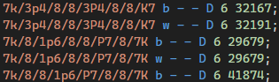
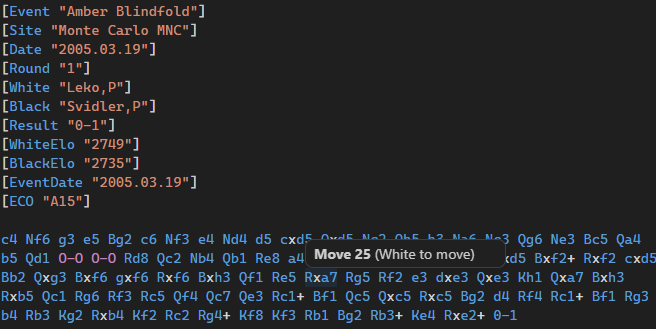
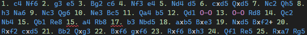
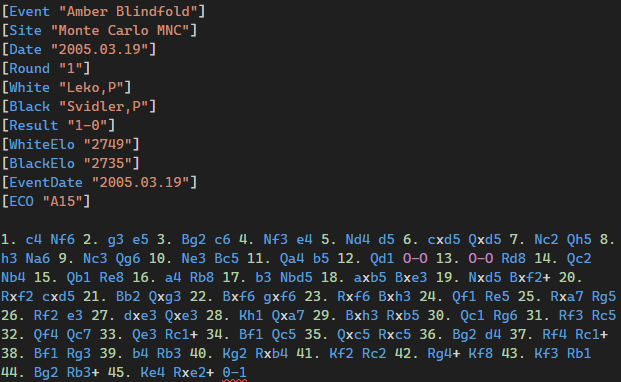

# Chess PGN & EPD Tools

Syntax highlighting, validation, and hover information for chess PGN and EPD files in Visual Studio Code.

## Features

### PGN Support

- **Syntax highlighting** for tags, moves, comments, variations, and NAGs.
- **Validation** of the Seven Tag Roster, tag syntax, and game termination markers.
- **Movetext validation** including:
  - SAN and long algebraic notation recognition
  - Variation nesting and comment balance
  - Move number consistency, including correct start from `FEN` tags
  - Game termination marker matching the `Result` tag
- **Hover information** on moves shows the current move number and side to move.
- **Hover information** on NAGs (e.g. `$2`) shows the annotation in plain English.

### EPD Support

- **Syntax highlighting** for piece placement, side to move, castling rights, en passant, and operations.
- **Validation** including:
  - Eight ranks in the piece placement field
  - Correct square count per rank
  - Side to move, castling rights, and en passant target checks
  - Operation semicolon termination
  - Operand type checks for common opcodes
  - String termination warnings

## Screenshots

### Syntax highglighting for EPD

### Hovers in PGN Files

### Validation for PGN Files

Checking of move numbers:

Checking of game termination marker:

## Usage

Open any `.pgn` or `.epd` file in VS Code. Diagnostics appear automatically in the Problems panel and as squiggly underlines in the editor. Hover over moves or NAGs in PGN files to see additional information.

No configuration is required.

## Requirements

- Visual Studio Code version 1.85.0 or higher.

## Known Limitations

- PGN move legality is not checked. Moves are only validated for syntactical correctness.
- User-defined EPD opcodes (starting with an uppercase letter) are not validated against operand types.
- Long algebraic notation (e.g. `e2-e4`) is accepted with a warning, since it is not part of the PGN export format.

## Release Notes

### 0.1.0

Initial release with PGN and EPD validation, syntax highlighting, and hover support.

## Feedback

If you find a bug or have a feature request, please open an issue on the repository.

## License

MIT
